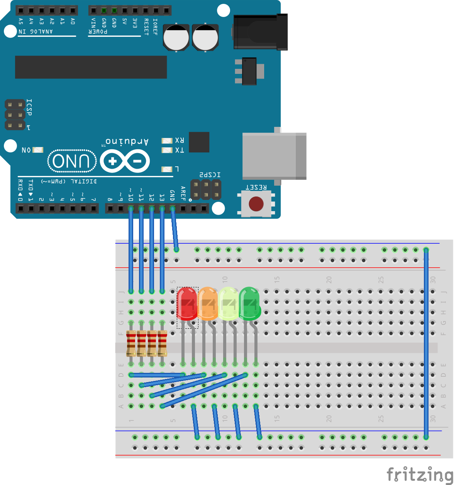

# Work status board
A project to display my status on my door so my family know whether they can disturb me or not - initially a present from my daughter.

## Setup
* Clone or download this repo
* Copy `secrets.h.template` to `secrets.h` and fill in your SSID, and WPA Key as well as an Auth Header secret, and a username and password that can be used to login. Notice that `secrets.h` is excluded from source control via `.gitignore` so you don't accidentally check it in. Note also that the auth header secret, the user name and the password can be any string. Obviously, your SSID and WPA key will have to match your network.
* Open the sketch in the Arduino IDE
* Update `TestESP8266.ino` so your pins are correct
* Set the board to whichever WEMOS board you have. I've tested this on the original D1 R1 and on the D1 Mini
* Wire up the board ([Fritzing file](./design/workk-status-board.fzz))
    * note that although an Arduino Uno is shown in the pic, you want to use a WEMOS D1 R1 or D1 Mini, as you need the wireless bits)
    * note also that although I've displayed the LEDs as being on the breadboard, they're actually mounted on a separate backing for the project itself

    <figure>
        
        <figcaption>Basic wiring diagram</figcaption>
    </figure>

* Open the serial monitor and set it to 115200bps (unless you changed the constant in the sketch)
* Upload the sketch

The LEDs should flash on and off together, then they should cycle until a WiFi connection is established.

Once the board is online, all the LEDS should go off and the SSID and the `IP Address` will be displayed in the serial window.

Using a web browser on the same network, navigate to `http://<ipaddress>` to get your status.

To set status, you need to authenticate. If you're not authenticated, you'll get a `404` when you try setting the lights. You'll still be able to see the current status at `/`. 

There are 3 ways to authenticate:

1. Pass a header called `AuthKey` with the value you put in `secrets.h`.
1. Pass the secret in as a query string argument called `AuthKey` to the url (e.g. `http://192.168.0.105/onACall?AuthKey=<MySecretKey>`)
1. Login - the key is stored as a cookie. You can logout from `/` if you're logged in

Setting a light is a matter of `GET`ting one of the following:
* `/onACall` - turns on the orange LED
* `/coding` - turns on the red LED
* `/workingHard` - turns on the yellow LED
* `/hardlyWorking` - turns on the green LED
* `/allOff` - turns off all the LEDs

Each of these will set the appropriate LED and redirect to `/` to display the status

